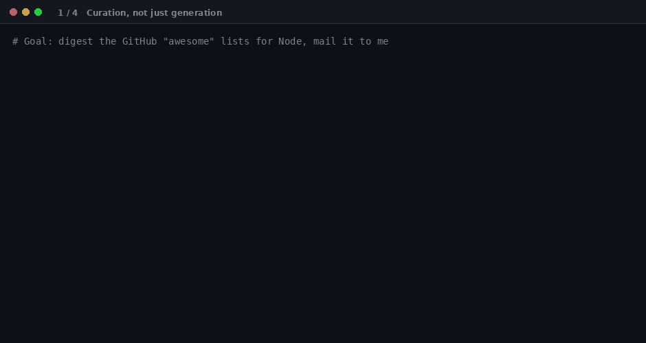

# mcp-api-translator

[](https://www.npmjs.com/package/mcp-api-translator)
[](https://github.com/krishgok/mcp-api-translator/actions/workflows/ci.yml)
[](LICENSE)
[](LICENSING.md)
[](https://modelcontextprotocol.io)

**An MCP server that generates MCP servers.** Give it an API definition — OpenAPI 3.0/3.1 or a
Postman collection — and it scaffolds a complete, runnable, _ownable_ TypeScript or Python MCP
server for that API.



_Above: curating Firecrawl's 20 operations down to 6, appending the Gmail API to the same server,
then an agent calling the self-hosted result to search GitHub "awesome" lists and email the digest._

## Why this and not a 1:1 generator

Turning an OpenAPI spec into MCP "tool stubs" is **not novel** — [FastMCP's `from_openapi`](https://gofastmcp.com/integrations/openapi),
[Speakeasy/Gram](https://www.speakeasy.com/blog/generate-mcp-from-openapi), and several
`openapi-mcp-generator` projects already do the mechanical part. A naive endpoint→tool generator has
no real advantage. This project focuses on the parts those tools skip:

**1. Curation, not just generation.** A 200-endpoint API naively becomes 200 tools, which wrecks a
model's tool-selection accuracy and blows out context. `analyze_spec` previews the tool list before
anything is written, every command takes `includeTags` / `methods` / `pathGlob` /
`excludeOperations`, and you get a warning when a server grows past 40 tools.

**2. Aggregation via append.** `extend_mcp_server` adds another API's tools to an existing project,
so you can build **one** MCP server spanning Firecrawl + Gmail + your internal API. Credentials stay
separate: each API also reads namespaced env vars derived from its title.

**3. An artifact you own.** Output is a normal project, not a hosted black box — readable per-tool
files, env-based auth, a Dockerfile, and a `server.json` plus client snippets for publishing to the
[official MCP Registry](https://registry.modelcontextprotocol.io).

If you only need throwaway, in-memory exposure of one API and don't care about owning the code,
FastMCP's runtime mode may suit you better — that's a deliberate non-goal here.

## Install

No install step. `npx` fetches and runs the latest published version — cross-platform, Node 20+.

### Claude Code

Claude Code does **not** read `claude_desktop_config.json` — it keeps its own MCP config:

```bash
claude mcp add api-translator -- npx -y mcp-api-translator
```

That registers it at `local` scope. Use `-s user` for all your projects, or commit a project-scoped
`.mcp.json` to share it. Verify with `claude mcp list`.

### Claude Desktop

Add to `claude_desktop_config.json` (macOS:
`~/Library/Application Support/Claude/claude_desktop_config.json`, Windows:
`%APPDATA%\Claude\claude_desktop_config.json`):

```json
{
  "mcpServers": {
    "api-translator": {
      "command": "npx",
      "args": ["-y", "mcp-api-translator"]
    }
  }
}
```

<details>
<summary><strong>Cursor, Cline, Continue.dev, Docker</strong></summary>

**Cursor** — `~/.cursor/mcp.json` (or project-scoped `.cursor/mcp.json`), same `mcpServers` shape as
Claude Desktop above.

**Cline (VS Code)** — sidebar → MCP Servers → Configure, same shape plus `"disabled": false`.

**Continue.dev** — `~/.continue/config.json`, under
`experimental.modelContextProtocolServers`, as a `{ transport: { type: "stdio", command, args } }`
entry.

**Docker** (no Node required):

```json
{
  "mcpServers": {
    "api-translator": {
      "command": "docker",
      "args": ["run", "--rm", "-i", "ghcr.io/krishgok/mcp-api-translator:latest"]
    }
  }
}
```

To read specs from disk or write projects to a host path, mount the directory with
`-v ${PWD}:/workspace` and pass `/workspace/...` as `specPath` / `outputDir`.

</details>

MCP config is read at startup, so restart your client — quit and reopen Claude Desktop, Cursor, …,
or start a new session in Claude Code.

## The four tools

| Tool                      | What it does                                                                       |
| ------------------------- | ---------------------------------------------------------------------------------- |
| `analyze_spec`            | Parse a spec and **preview** the tools that would be generated — no files written. |
| `generate_mcp_server`     | Generate a complete MCP-server project into `outputDir`.                           |
| `extend_mcp_server`       | Append another spec's tools to an existing project (idempotent).                   |
| `list_supported_features` | Report supported formats, auth schemes, transports, and limits.                    |

All spec inputs accept inline text (`spec`) or a local path (`specPath`), JSON or YAML.

## Usage

You don't call the tools by hand — you ask your agent, and it drives them.

**1. Preview, then curate.** See what a spec becomes before writing anything:

> _"Analyze ./firecrawl.json and show me the proposed tools."_
> _"Just the search and scraping ones."_

```js
analyze_spec({ specPath: "./firecrawl.json", includeTags: ["Search", "Scraping"] });
// → 20 operations, 6 kept — plus the auth scheme and env vars the server will need
```

**2. Generate**, with the same filters plus an output directory:

```js
generate_mcp_server({
  specPath: "./firecrawl.json",
  outputDir: "./blog-digest-mcp",
  includeTags: ["Search", "Scraping"],
});
// options: language: "python", transport: "http", auth: {...}, force: true
```

**3. Aggregate** — add more APIs to the same server:

```js
extend_mcp_server({
  projectDir: "./blog-digest-mcp",
  specPath: "./gmail.yaml",
  pathGlob: "/gmail/v1/users/*/messages**",
});
// idempotent; hand-edited tool files are preserved
```

**4. Run it.** The output is a normal project you own:

```bash
cd blog-digest-mcp && npm install && npm run build
cp .env.example .env   # set API_BASE_URL + credentials (never embedded in code)
npm start
```

Register it with your client using the generated `client-config.md`, and your agent can call the
APIs directly.

Full walkthrough with sample outputs and troubleshooting:
**[docs/usage-workflow.md](docs/usage-workflow.md)**.

## Generate, or serve

- **Generate** ownable code when you want a project you can hand-edit, self-host, and own — in
  **TypeScript** (default) or **Python** (`language: "python"`).
- **Serve** a live runtime proxy when you just want an API exposed to an agent **now**, with no
  generated files to build or maintain:

  ```bash
  mcp-api-translator serve --spec ./api.yaml
  mcp-api-translator serve --spec ./a.yaml --spec ./b.yaml --methods GET,POST   # aggregate
  ```

`serve` runs the same request plan and env-based auth the generator emits, so behavior matches
generated output exactly — it just skips the codegen step. It speaks stdio by default, or stateless
Streamable HTTP with `--transport http --port 3000`. Logs are structured JSON lines on stderr in
containers, readable text on a TTY (`LOG_LEVEL`, `LOG_FORMAT`).

## Documentation

| Doc                                                 | What's in it                                                        |
| --------------------------------------------------- | ------------------------------------------------------------------- |
| [usage-workflow.md](docs/usage-workflow.md)         | End-to-end walkthrough, curation loop, auth setup, troubleshooting. |
| [design.md](docs/design.md)                         | Tech stack, generated project layout, limitations, security model.  |
| [deploy-serve.md](docs/deploy-serve.md)             | Docker/compose recipes for `serve`, logging and observability.      |
| [serve-api-proposal.md](docs/serve-api-proposal.md) | Design of the runtime proxy and the roadmap.                        |
| [market-analysis.md](docs/market-analysis.md)       | Why both generate and serve models exist.                           |
| [CONTRIBUTING.md](CONTRIBUTING.md)                  | Dev setup, PR conventions, DCO sign-off.                            |

**Known limits at a glance:** OpenAPI 3.0/3.1 and Postman v2.1 (Swagger 2.0 best-effort), no
GraphQL/gRPC; no interactive OAuth consent flows; no upstream streaming or auto-pagination; output
quality tracks spec quality. Details and the security model: [docs/design.md](docs/design.md).

## Development

```bash
npm install
npm test          # unit + integration (parsers, curation, emit, append)
npm run typecheck
npm run build
npm run e2e       # generate a sample project from the fixtures into build/e2e-out
```

Contributions welcome — see [CONTRIBUTING.md](CONTRIBUTING.md). All commits must be signed off under
the [Developer Certificate of Origin](https://developercertificate.org/) (`git commit -s`).

## License

`mcp-api-translator` is **dual-licensed** — © 2026 krishgok. Full details in
[LICENSING.md](LICENSING.md).

- **Open source:** [GNU AGPL-3.0-or-later](LICENSE). Running a modified version as a network service
  requires offering that version's complete source to its users.
- **Commercial:** a separate license is available for embedding in proprietary products without
  AGPL obligations.
- **Your generated output is yours.** Projects produced by this tool are covered by a
  [generated-output exception](LICENSING.md#3-generated-output-exception) and are **not** subject to
  the AGPL.

Redistributions must retain [`LICENSE`](LICENSE) and [`NOTICE`](NOTICE). The licenses do **not**
grant the right to use the "mcp-api-translator" name to endorse or promote forked or derivative
works without prior written permission.
